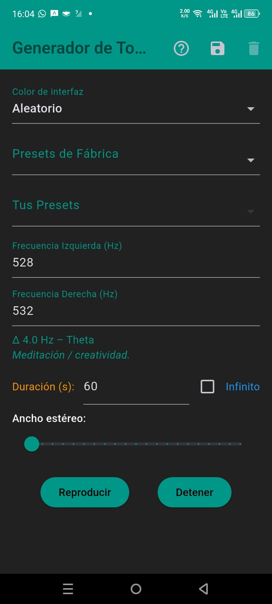

# 🧠 Binaural Tone Generator

Generador de ondas cerebrales (Binaural Beats) simple y eficaz. Esta aplicación genera audio en tiempo real (sin archivos pre-grabados) para inducir estados de relajación, concentración o sueño mediante la manipulación de frecuencias.

## 🚀 Funcionalidades

* **Síntesis Pura:** Generación matemática de ondas sinusoidales en tiempo real para una precisión de frecuencia absoluta.
* **Control Total:**
    * Frecuencia Base (Oído Izquierdo).
    * Frecuencia Objetivo (Oído Derecho).
    * Diferencial (Beat) y Ancho Estéreo.
* **Presets Inteligentes:** Configuraciones listas para usar basadas en rangos de ondas cerebrales:
    * **Delta (1-4 Hz):** Sueño profundo.
    * **Theta (4-8 Hz):** Meditación y creatividad.
    * **Alpha (8-14 Hz):** Relajación y enfoque.

## 📥 Descarga

El instalador (APK) está disponible en la sección de **[Releases](../../releases)**.

---

> **Autor:** Raúl Héctor Cámara Carreón
